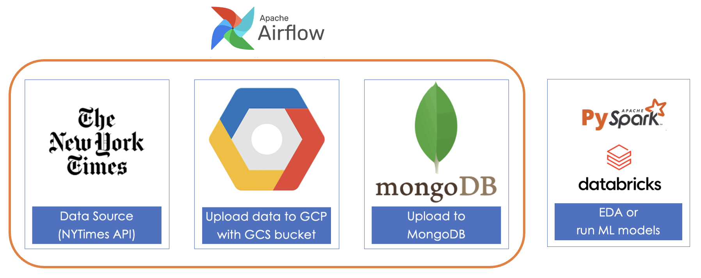

# Distributed Data System: NYT Articles to GCS and MongoDB Pipeline

  

## Project goal: 
This project automates the process of fetching articles from the New York Times (NYT) API, uploading them to Google Cloud Storage (GCS), and then writing the data into a MongoDB collection. It utilizes Apache Airflow to schedule and orchestrate the workflow.

## Features
- Automated Data Fetching: Automatically fetches articles from the NYT API based on specified keywords.
- Data Storage: Stores article data in Google Cloud Storage for durable, scalable storage.
- Database Integration: Writes fetched article data into a MongoDB collection for querying and analysis.

## Prerequisites
Before you begin, ensure you have met the following requirements:
- Python 3.6+
- Access to the New York Times API ([Get Started](https://developer.nytimes.com/docs/articlesearch-product/1/overview))
- A Google Cloud Platform (GCP) account with a configured GCS bucket
- Access to a MongoDB database
- Apache Airflow setup

## Configuration
- NYT API Key: Obtain your API key from the NYT Developer portal and replace 'YOUR_API_KEY' in the DAG file with your actual API key.
- GCP Setup: Configure your GCP project ID, GCS bucket name, and ensure your environment is authenticated with GCP.
- MongoDB URI: Replace 'YOUR_MONGO_URI', 'YOUR_DB_NAME', and 'YOUR_COLLECTION_NAME' with your MongoDB connection URI, database name, and collection name, respectively.
- Airflow DAG: Place the DAG file in your Airflow DAGs folder.

## Project Structure
The workflow is defined in an Airflow DAG and consists of two main tasks:

- Fetch Articles and Upload to GCS: This task fetches articles from the NYT API and uploads the data to a specified GCS bucket.
- Download from GCS and Write to MongoDB: This task downloads the article data from GCS and writes it into a MongoDB collection.

To trigger the workflow, ensure your Airflow environment is running and trigger the msds697-group11 DAG from the Airflow UI.
